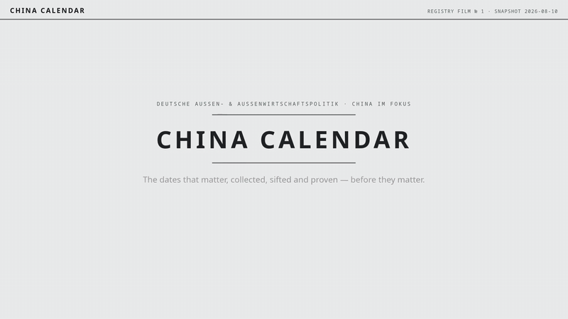
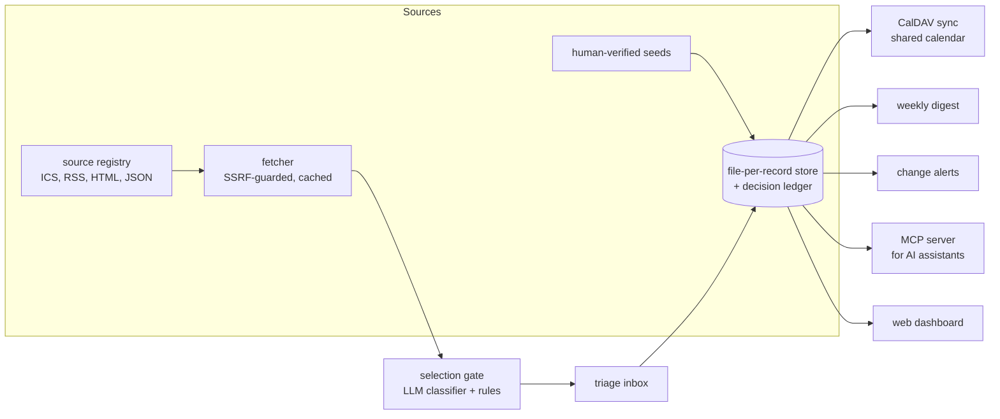

# china-calendar

A provenance-first tracker for the dates that matter in China and
Asia-Pacific focused policy work.

## The problem

The dates that shape a China-focused work programme (party plenums, NPC
sessions, summits, elections, EU legislative deadlines) are scattered
across dozens of sites, announced late, and moved often. Hand-maintained
spreadsheets go stale, and no date in them says where it came from.

china-calendar collects candidate dates from registered sources, triages
them with an LLM gate, stores every date with its provenance, and projects
the result into a shared calendar colleagues subscribe to. The production
instance tracks around 290 events from 19 sources, swept daily.

Generalised from a production system in daily use. The published version
contains the architecture and code with a sample source registry and seed
file; the event store is data, not code, and is not in the repo. Everything
visible in the screenshots and film below comes from public sources
(official calendars, feeds and press pages).

## Two invariants

Both enforced in code, not by convention:

1. **The model never originates a date.** Every date traces to a fetched
   source (URL, quoted evidence, retrieval timestamp) or an explicit human
   statement; verification is literal string matching, never model
   judgement.
2. **One core, many adapters.** CLI, MCP server, dashboard and sweep all
   call the same store through the same validation; there is no second
   write path.

## Interface

The dashboard: triage queue, then the next 90 days:


The full store, filterable, with tier and verification state per event:


The month grid; long spans are listed, not smeared across cells:


The 60-second registry film
([mp4 in full quality](docs/media/registry-film.mp4)):



## How it works



A daily sweep fetches every registered source, runs new items through the
gate, verifies stored dates against their sources, and syncs the calendar.
Trusted source and item-type pairs auto-accept; everything else waits in
the triage inbox. Human decisions land in the ledger and feed back to the
classifier as calibration examples.

Provenance is graded. Tiers say where a date came from (0 manual, 1 feeds,
2 scraped, 3 researched projections); statuses say how solid it is
(confirmed, scheduled, rumored, projected, unverified) and are assigned by
the engine from the evidence, never by the caller. Projected windows sync
as all-day spans with the status in the title.

## Design decisions

- Files over a database: one JSON file per event, an append-only decision
  ledger, a generated index.
- SSRF-guarded fetching: scheme and private-network checks, response-size
  caps, ETag caching.
- Provider-agnostic LLM layer via OpenAI-compatible API endpoints;
  versioned prompt files; per-day token metering.
- Human decisions are load-bearing: Tier 0 records are immune to
  automation, triage is the default path, the ledger records who decided.
- The calendar is a one-way projection; the store is the source of truth.

## Deployment

Two containers (MCP server and dashboard) plus systemd timers for the sweep
and backups, documented in [deploy/](deploy/). The MCP endpoint binds
loopback and is published through a tunnel; AI assistants authenticate via
OAuth against a self-hosted identity provider, other clients via bearer
token. The dashboard, digest and change notifications ride the same box.

## Integration with chat interfaces

The MCP server (`pcal-mcp`, streamable HTTP) exposes the store as tools:
search, upcoming events, event details, triage, verification. A chat UI
connected to it can answer "what's coming in October?" from the store,
with tier and source attached to every date.

- Local assistants (Claude Desktop, Claude Code, and other MCP clients):
  connect to the HTTP endpoint with the bearer token (`PC_MCP_TOKEN`).
- Self-hosted chat UIs, OpenWebUI as the example: add the endpoint as an
  MCP tool server (directly over streamable HTTP, or through its `mcpo`
  OpenAPI bridge). Every user of the shared UI then queries the same
  store the calendar is projected from.
- Write tools go through the same validation as the CLI; provenance rules
  hold no matter which interface asks.

## Repository map

| Path | What |
|---|---|
| [src/china_calendar/models.py](src/china_calendar/models.py) | Event, decision and source schemas; status semantics |
| [src/china_calendar/store.py](src/china_calendar/store.py) | File-per-record store, index, ledger |
| [src/china_calendar/gate.py](src/china_calendar/gate.py) | Selection gate: rules plus LLM classifier |
| [src/china_calendar/sweep.py](src/china_calendar/sweep.py) | The daily fetch/verify/sync cycle |
| [src/china_calendar/calsync.py](src/china_calendar/calsync.py) | Store to CalDAV projection |
| [src/china_calendar/mcp_server.py](src/china_calendar/mcp_server.py) | MCP tools for AI assistants |
| [sources.yaml](sources.yaml) | Source registry (fetch targets, trust flags) |
| [seeds/](seeds/) | Human-verified seed windows, example file |
| [prompts/](prompts/) | Versioned classifier and extractor prompts |
| [deploy/](deploy/) | Containers, systemd units, migrations |
| [tests/](tests/) | 265 tests, run with `uv run pytest` |

## Usage

```sh
uv sync
uv run pcal init                    # create the store layout
uv run pcal seed seeds/tier3-2026.yaml
uv run pcal list --days 120         # what's coming
uv run pcal add "Event title" --start 2026-11-03 --evidence "where the date comes from"
uv run pcal sweep                   # fetch, gate, verify, sync
```

The CLI, MCP server and dashboard share one store; set `PC_STORE_DIR` to
point them somewhere specific. LLM-dependent stages read
`PC_LLM_BASE_URL` and `PC_LLM_API_KEY` from the environment; everything
else runs without a model.
