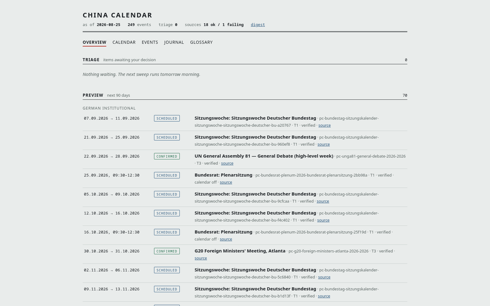
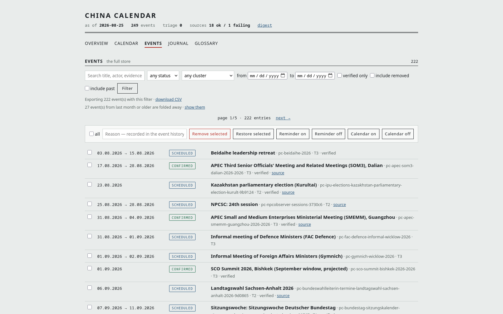
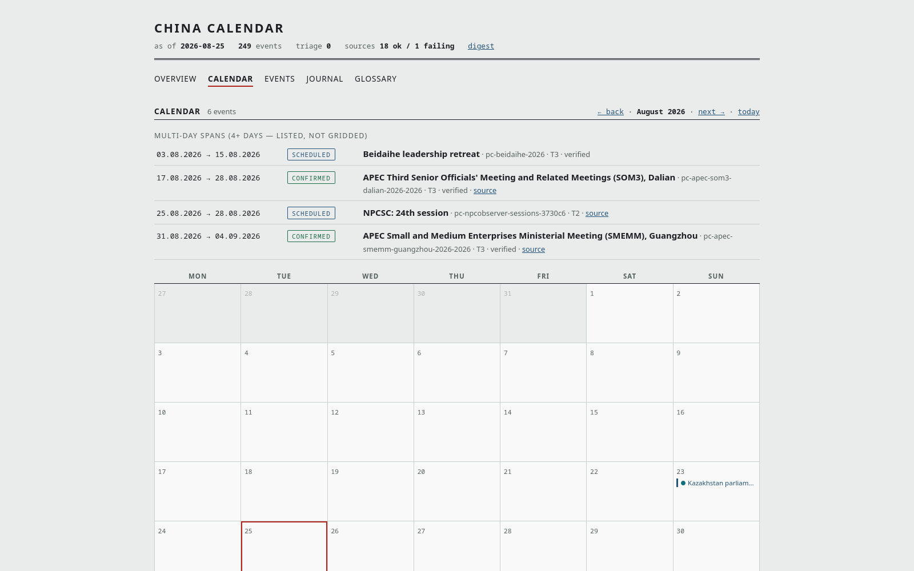
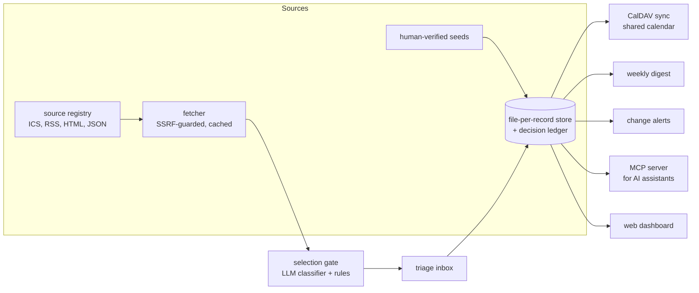

# china-calendar

A provenance-first tracker for the dates that matter in China and
Asia-Pacific focused policy work.

## The problem

The dates that shape a China-focused work programme (party plenums, NPC
sessions, summits, elections, EU legislative deadlines) are scattered across
dozens of sites, announced late, moved often, and sometimes never announced
at all. Tracking them by hand means someone maintains a spreadsheet until
they stop, and every date in it is only as trustworthy as the memory of
whoever typed it.

china-calendar replaces the spreadsheet with an engine. It collects
candidate dates from registered sources, triages them with an LLM gate,
keeps a provenance record for every date it stores, and projects the result
into a shared calendar that colleagues can simply subscribe to. The
production instance currently tracks around 290 events from 19 registered
sources, swept daily.

Generalised from a production system in daily use. The published version
contains the architecture and code with a sample source registry and seed
file; the event store is data, not code, and is not in the repo.

## Two invariants

The design hangs on two rules, and both are enforced in code rather than by
convention:

1. **The model never originates a date.** Every date traces to a fetched
   source (URL, quoted evidence, retrieval timestamp) or an explicit human
   statement. Verification is literal string matching against the fetched
   text, never model judgement. The LLM classifies and extracts; it is not
   trusted to remember.
2. **One core, many adapters.** The CLI, the MCP server, the web dashboard
   and the sweep all call the same store through the same validation. There
   is no second write path to drift out of sync.

## What it looks like

The dashboard: triage queue, then the next 90 days with status badges and a
source link on every verified date:



The full store, filterable, with tier and verification state on each event:



The month grid, with long spans listed rather than smeared across cells:



There is also a 60-second [registry film](docs/media/registry-film.mp4)
that walks through the engine on a real data snapshot.

## How it works



A daily sweep fetches every registered source, runs new items through the
gate, verifies stored dates against their sources, and syncs the calendar.
Trusted source and item-type pairs auto-accept; everything else waits in a
triage inbox for a human decision. Each decision is appended to a ledger,
and recent human decisions are fed back to the classifier as calibration
examples, so the gate learns the profile of what the team actually wants.

Provenance is graded, not binary. Tiers describe where a date came from
(0 manual, 1 structured feeds, 2 scraped pages, 3 researched projections);
statuses describe how solid it is (confirmed, scheduled, rumored, projected,
unverified) and are assigned by the engine from the evidence, never by the
caller. A projected window like a leadership retreat syncs as an all-day
span with its status in the title, because an empty October reads as
"nothing is happening", which is worse than "(Projected)".

## Design decisions that carry over

- **Files over a database.** One JSON file per event plus an append-only
  decision ledger and a generated index. Trivially backed up, diffed,
  audited and restored; no migration risk for a store this size.
- **Fail-safe fetching.** The fetch path refuses non-HTTP schemes and
  private-network destinations (the classic SSRF holes), caps response
  sizes, and honours ETags so unchanged sources cost nothing.
- **Provider-agnostic LLM layer.** The classifier and extractor speak the
  OpenAI-compatible chat API against whatever endpoint the environment
  configures. Prompts are versioned files in the repo, token usage is
  metered per day and visible on the dashboard.
- **Human decisions are load-bearing.** Tier 0 records are immune to
  automated modification, the triage inbox is the default path for anything
  not explicitly trusted, and the ledger records who or what decided.
- **The calendar is a projection.** Store to calendar is one-way; the store
  is the source of truth and a calendar edit is overwritten on the next
  sync. Colleagues consume a read-only subscription, not a shared editable
  calendar that slowly rots.

## Deployment

Two containers (MCP server and dashboard) plus systemd timers for the sweep
and backups, documented in [deploy/](deploy/). The MCP endpoint binds
loopback and is published through a tunnel; AI assistants authenticate via
OAuth against a self-hosted identity provider, other clients via bearer
token. The dashboard, digest and change notifications ride the same box.

## What integrating this at MERICS would look like

The engine is a self-contained Python package with no infrastructure
opinions beyond "somewhere to run a daily job". An institutional deployment
would adapt the source registry to the team's watchlist, point the LLM
layer at a sanctioned endpoint, and sync into a calendar on the existing
groupware. The triage inbox is deliberately small surface: one person
spending minutes a day keeps the calendar trustworthy, and the provenance
ledger means anyone can ask "why is this date here?" and get an answer.

## Repository map

| Path | What |
|---|---|
| [src/china_calendar/models.py](src/china_calendar/models.py) | Event, decision and source schemas; status semantics |
| [src/china_calendar/store.py](src/china_calendar/store.py) | File-per-record store, index, ledger |
| [src/china_calendar/gate.py](src/china_calendar/gate.py) | Selection gate: rules plus LLM classifier |
| [src/china_calendar/sweep.py](src/china_calendar/sweep.py) | The daily fetch/verify/sync cycle |
| [src/china_calendar/calsync.py](src/china_calendar/calsync.py) | Store to CalDAV projection |
| [src/china_calendar/mcp_server.py](src/china_calendar/mcp_server.py) | MCP tools for AI assistants |
| [sources.yaml](sources.yaml) | Source registry (fetch targets, trust flags) |
| [seeds/](seeds/) | Human-verified seed windows, example file |
| [prompts/](prompts/) | Versioned classifier and extractor prompts |
| [deploy/](deploy/) | Containers, systemd units, migrations |
| [tests/](tests/) | 265 tests, run with `uv run pytest` |

## Running it

```sh
uv sync
uv run pcal init                    # create the store layout
uv run pcal seed seeds/tier3-2026.yaml
uv run pcal list --days 120         # what's coming
uv run pcal add "Event title" --start 2026-11-03 --evidence "where the date comes from"
uv run pcal sweep                   # fetch, gate, verify, sync
```

The CLI, MCP server and dashboard share one store; set `PC_STORE_DIR` to
point them somewhere specific. LLM-dependent stages read
`PC_LLM_BASE_URL` and `PC_LLM_API_KEY` from the environment; everything
else runs without a model.
